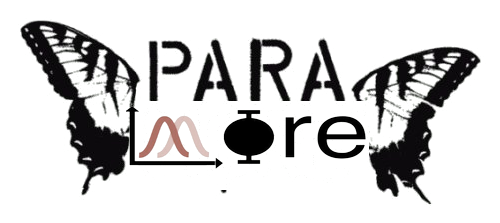

<div align="center" style="height:250px;width:400px">
</img>
</div>

# paramore

## Setup

```
cmsrel CMSSW_14_1_0_pre4
cd CMSSW_14_1_0_pre4/src
cmsenv
git clone https://github.com/cms-analysis/HiggsAnalysis-CombinedLimit.git HiggsAnalysis/CombinedLimit
cd HiggsAnalysis/CombinedLimit
git fetch origin
git checkout v10.1.0
scramv1 b clean; scramv1 b

cd data/tutorials/parametric_exercise
git clone git@github.com:maxgalli/paramore.git
git clone git@github.com:maxgalli/StatsStudies.git
```

### Setup with `uv`

```shell
uv sync
uv run examples/part1_2.py
```

## Package usage

Install the project in editable mode and run any of the example scripts using the package API:

```shell
pip install -e .
python examples/part1_2.py
```

Key functionality is exposed via `paramore`, for example:

```python
from paramore import Gaussian, plot_as_data
```

Example datasets live alongside the scripts in `examples/samples`:
- `data_part1.parquet` and `mc_part1.parquet`
- `mc_part3_ggH_Tag0.parquet` plus photon-ID variations

## Links

- [combine parametric fit tutorial](https://cms-analysis.github.io/HiggsAnalysis-CombinedLimit/latest/tutorial2023/parametric_exercise/#session-structure)
- [zfit version](https://github.com/maxgalli/StatsStudies/tree/master/ExercisesForCourse/Hgg_zfit) to get stuff from
